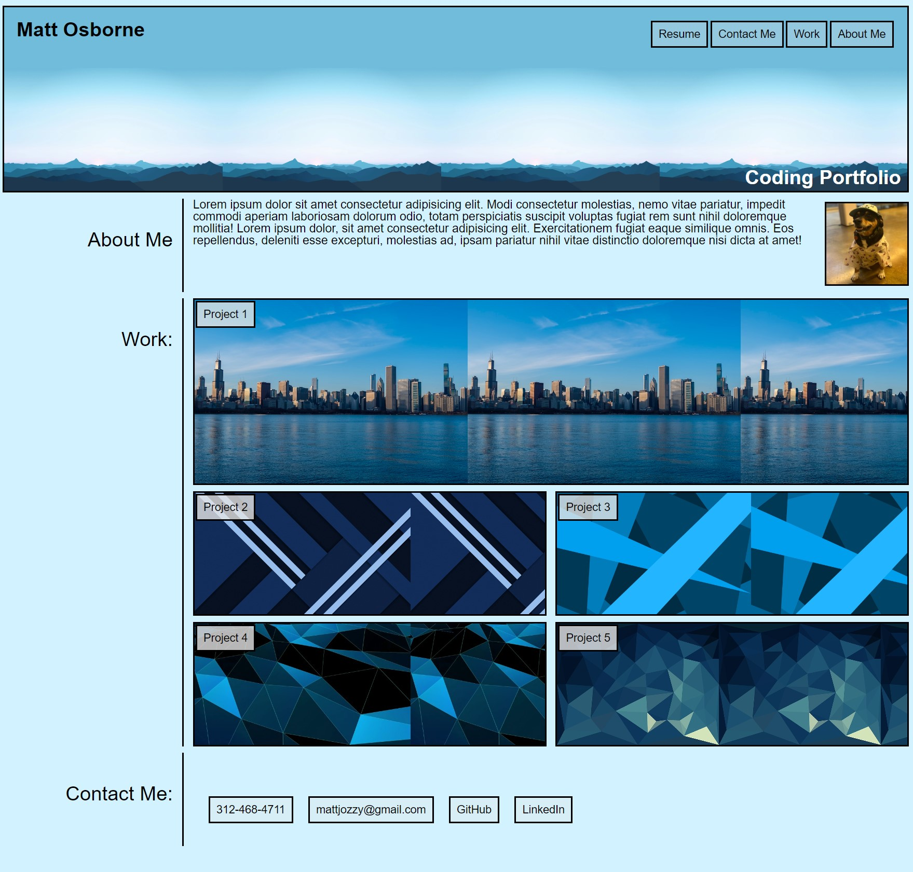

# Portfolio
Professional Portfolio

In this assignment I created a home page to my personal portfolio from scratch. As I complete projects I will be able to use this page to showcase them to potential employers. This web application utilizes navigation links, media queries, and CSS variables. As I progress as a web developer I will update this porfolio to look more professional.

<a href="https://github.com/MattOz/Portfolio" target="_blank">GitHub Repository</a>

<a href="https://mattoz.github.io/Portfolio/" target="_blank">Live Link</a>

